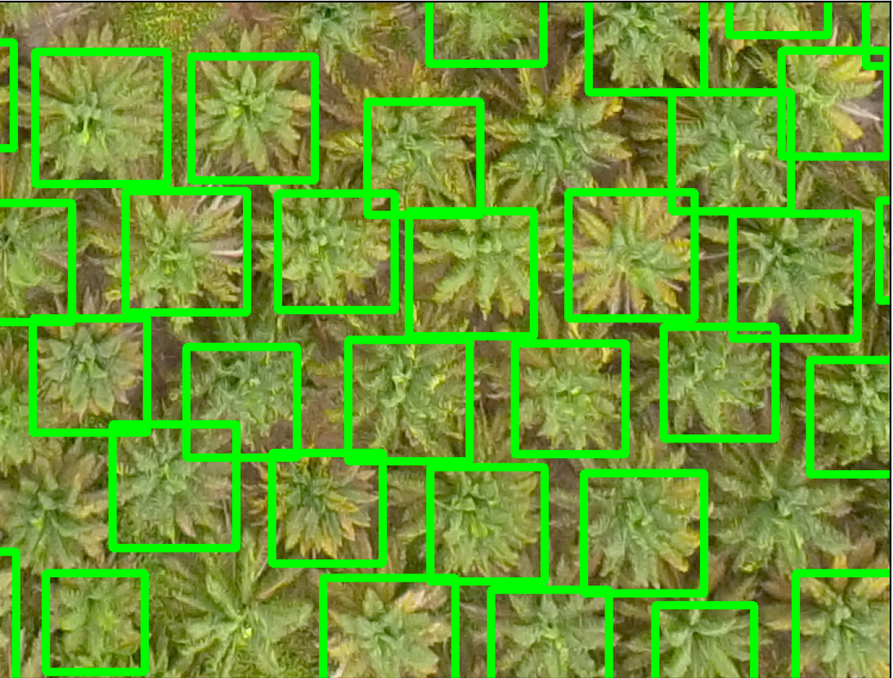

# 🌳 Tree Detection from Aerial Images using Haar Cascade

## 📌 Overview
This project uses **OpenCV** and **Haar Cascade Classifier** to detect **trees** from aerial imagery.  
The model identifies trees in satellite or drone images and highlights them with bounding boxes.  
Such tree detection can be highly useful for **geographical analysis, forestry studies, urban planning, and environmental monitoring**.

---

## ⚙️ Tech Stack
- **Programming Language**: Python
- **Tools**: Cascade Trainer GUI
- **Libraries**:  
  - OpenCV (for image processing and Haar Cascade detection)  
  - Matplotlib (for visualization)  

---

## 📂 Main Project Files
```
├── main.py               # Main script to run detection
├── cascade5.xml          # Pre-trained Haar Cascade XML file (tree detector)
├── main_test1.jpg        # Sample aerial input image
```

---

## 🚀 How It Works
1. **Load Image** – Reads the aerial image using OpenCV.  
2. **Convert Color Space** – Converts the image from **BGR → RGB** for proper visualization.  
3. **Adjust Parameters** – Based on image size, defines `minSize` and `maxSize` to improve detection accuracy.  
4. **Haar Cascade Detection** – Uses the `cascade5.xml` classifier to detect **trees** in the image.  
5. **Draw Bounding Boxes** – Detected trees are highlighted with green rectangles.  
6. **Visualization** – Final results are displayed using Matplotlib.  

---

## 📜 Haar Cascade Explanation
- A **Haar Cascade Classifier** is a machine learning–based object detection algorithm.  
- It works by training on **positive samples** (images containing trees) and **negative samples** (images without trees).  
- The classifier learns **Haar-like features** (contrast patterns of light and dark areas) to identify objects.  
- In this project, we use a pre-trained Haar Cascade (`cascade5.xml`) built using Cascade Trainer GUI specifically tuned for **tree detection**.

---

## 🖼️ Sample Output
When a tree is detected, a **green rectangle** is drawn around it:  

```
[Tree detected in aerial image]
```

 

---

## 🌍 Applications
- **Forestry & Ecology** – Monitor forest health, tree density, and deforestation.  
- **Urban Planning** – Track green cover in cities for sustainable development.  
- **Agriculture** – Analyze tree distribution in orchards and plantations.  
- **Environmental Studies** – Measure carbon sequestration potential.  

---

## ▶️ How to Run
1. Clone the repository:
   ```bash
   git clone https://github.com/your-username/tree-detection.git
   cd tree-detection
   ```
2. Install dependencies:
   ```bash
   pip install opencv-python matplotlib
   ```
3. Run the detection script:
   ```bash
   python main.py
   ```

---

## 🔑 Key Parameters
- `minSize` → Minimum size of detected object (helps ignore very small noise).  
- `maxSize` → Maximum size of detected object (adjusted based on image resolution).  
- `scaleFactor` & `minNeighbors` → Tune detection sensitivity and reduce false positives.  

---

## 📖 Example Code Snippet
```python
tree_data = cv2.CascadeClassifier('cascade5.xml')
found = tree_data.detectMultiScale(img, minSize=(65, 65), maxSize=(100, 100))

for (x, y, w, h) in found:
    cv2.rectangle(img_rgb, (x, y), (x + w, y + h), (0, 255, 0), 5)
```


---
